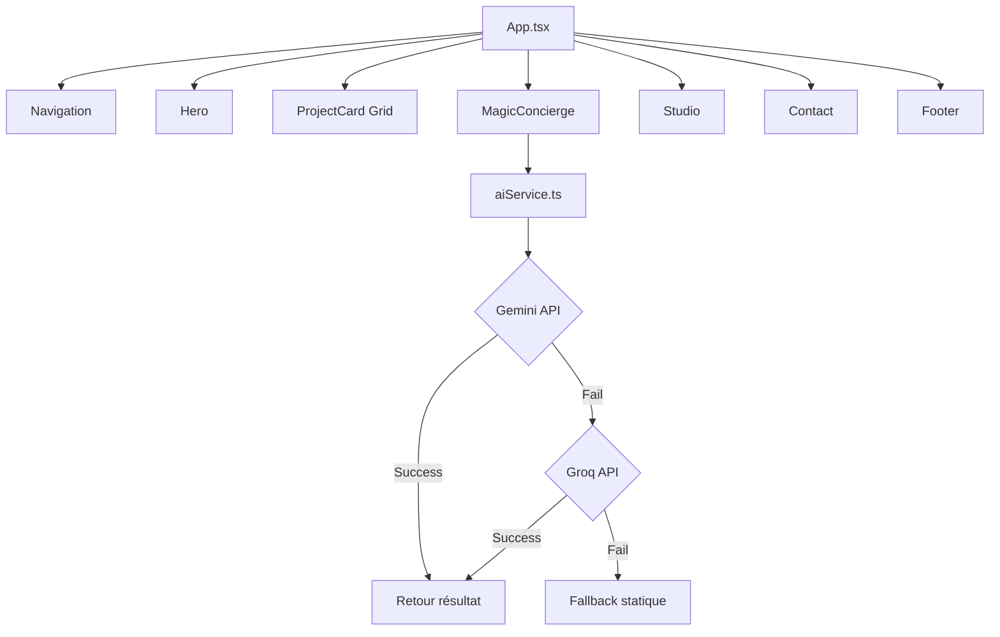

# 🪄 Woodoo Studio - Documentation Technique

> Alchimie Numérique - Un site vitrine pour un studio de design créatif avec intégration IA

## 📋 Table des Matières

- [Vue d'ensemble](#vue-densemble)
- [Architecture](#architecture)
- [Installation](#installation)
- [Configuration](#configuration)
- [Composants](#composants)
- [Services](#services)
- [Déploiement](#déploiement)
- [Guide de Contribution](#guide-de-contribution)

---

## 🎯 Vue d'ensemble

**Woodoo Studio** est un site vitrine moderne pour une agence de design et développement créatif. Le site présente :

- ✨ Design immersif avec effets parallax
- 🤖 Intégration IA (Gemini + Groq en fallback)
- 🎨 Interface glassmorphic et animations fluides
- 📱 Responsive design
- ⚡ Performance optimisée avec Vite

### Technologies Principales

| Technologie | Version | Usage |
|------------|---------|-------|
| **React** | 19.2.0 | Framework UI |
| **TypeScript** | 5.8.2 | Typage statique |
| **Vite** | 6.2.0 | Build tool |
| **Tailwind CSS** | CDN | Styling |
| **Google Gemini AI** | 1.30.0 | IA principale |
| **Groq API** | - | IA fallback |

---

## 🏗️ Architecture

### Structure du Projet

```
woodoo-studio/
├── components/
│   ├── Contact.tsx          # Formulaire de contact
│   ├── Footer.tsx           # Footer du site
│   ├── Hero.tsx             # Section hero avec parallax
│   ├── MagicConcierge.tsx   # Interface IA interactive
│   ├── Navigation.tsx       # Menu de navigation
│   ├── ProjectCard.tsx      # Carte de projet
│   ├── Studio.tsx           # Section "À propos"
│   └── ui/
│       └── Icons.tsx        # Composants d'icônes SVG
├── services/
│   └── aiService.ts         # Service IA (Gemini + Groq)
├── App.tsx                  # Composant racine
├── types.ts                 # Définitions TypeScript
├── index.tsx                # Point d'entrée
├── index.html               # Template HTML
├── .env.local               # Variables d'environnement
└── package.json             # Dépendances
```

### Flux de Données



---

## 🚀 Installation

### Prérequis

- **Node.js** >= 18.0.0
- **npm** ou **yarn**
- Clés API : Gemini et/ou Groq

### Étapes

```bash
# 1. Cloner le dépôt
git clone <repository-url>
cd woodoo-studio

# 2. Installer les dépendances
npm install

# 3. Configurer les variables d'environnement
# Créer un fichier .env.local (voir section Configuration)

# 4. Lancer le serveur de développement
npm run dev

# Le site sera accessible sur http://localhost:5173
```

---

## ⚙️ Configuration

### Variables d'Environnement

Créez un fichier `.env.local` à la racine du projet :

```env
# Clé API Gemini (obligatoire pour l'IA primaire)
API_KEY=your_gemini_api_key_here

# Clé API Groq (optionnelle, pour le fallback)
GROQ_API_KEY=your_groq_api_key_here
```

#### Obtenir les Clés API

- **Gemini** : [Google AI Studio](https://aistudio.google.com/apikey)
- **Groq** : [Groq Console](https://console.groq.com/)

### Configuration Tailwind

Le thème Tailwind est configuré directement dans `index.html` :

```javascript
woodoo: {
  950: '#050505',  // Background ultra-dark
  900: '#0a0a0a',
  800: '#171717',
  700: '#262626',
  accent: '#6366f1' // Indigo 500
}
```

---

## 🧩 Composants

### 1. **Hero.tsx**

Section d'en-tête avec effets parallax multi-couches.

**Props** : Aucune

**Fonctionnalités** :
- Parallax scroll sur 2 couches (0.1x et 0.25x)
- Gradient animé
- Call-to-action vers la section portfolio

### 2. **MagicConcierge.tsx**

Interface IA interactive pour générer des concepts créatifs.

**Props** : Aucune

**États** :
- `prompt` : Texte d'entrée utilisateur
- `loading` : État de chargement
- `result` : Réponse IA (MagicResponse)

**Fonctionnalités** :
- Génération de concepts via `aiService`
- Animation de chargement
- Réinitialisation du formulaire

### 3. **Studio.tsx**

Section "À propos" avec animations au scroll.

**Props** : Aucune

**Fonctionnalités** :
- Intersection Observer pour déclencher les animations
- Statistiques du studio (15+ prix, 40+ projets)
- Grid responsive avec cartes thématiques

### 4. **Navigation.tsx**

Menu de navigation sticky.

**Props** : Aucune

**Liens** :
- Work
- Studio
- Services
- Contact

### 5. **ProjectCard.tsx**

Carte de projet avec hover effects.

**Props** :
```typescript
interface ProjectCardProps {
  project: Project;
  className?: string;
}
```

**Effet** : Animations de scale et overlay au survol

### 6. **Contact.tsx**

Formulaire de contact.

**Props** : Aucune

**Champs** :
- Nom
- Email
- Message

### 7. **Footer.tsx**

Pied de page avec liens et informations.

**Props** : Aucune

---

## 🤖 Services

### aiService.ts

Service centralisé pour les interactions IA avec système de fallback.

#### Fonction Principale

```typescript
async function generateMagicConcept(prompt: string): Promise<MagicResponse>
```

**Paramètres** :
- `prompt` : Idée de l'utilisateur

**Retour** :
```typescript
interface MagicResponse {
  title: string;      // Titre mystique (1 mot)
  tagline: string;    // Tagline (5 mots max)
  concept: string;    // Description (2 phrases)
}
```

#### Logique de Fallback

1. **Tentative 1** : Gemini API (`gemini-2.5-flash`)
   - Utilise structured output avec schéma JSON
   
2. **Tentative 2** : Groq API (`llama-3.3-70b-versatile`)
   - Endpoint OpenAI-compatible
   - JSON mode activé

3. **Fallback statique** : Message d'erreur gracieux

#### Logs Console

```
✅ Gemini API succeeded
⚠️ Gemini API failed, trying Groq fallback...
✅ Groq API succeeded
❌ Groq API also failed
⚠️ Using static fallback
```

---

## 📦 Déploiement

### Build Production

```bash
# Créer le build optimisé
npm run build

# Prévisualiser le build
npm run preview
```

Le dossier `dist/` contiendra les fichiers statiques prêts pour le déploiement.

### Plateformes Recommandées

| Plateforme | Commande |
|-----------|----------|
| **Vercel** | `vercel --prod` |
| **Netlify** | Drag & drop du dossier `dist/` |
| **GitHub Pages** | Push vers branche `gh-pages` |
| **Google AI Studio** | Déployé automatiquement |

### Variables d'Environnement en Production

N'oubliez pas de configurer `API_KEY` et `GROQ_API_KEY` dans les settings de votre plateforme.

---

## 🛠️ Guide de Contribution

### Workflow Git

```bash
# 1. Créer une branche
git checkout -b feature/nouvelle-fonctionnalite

# 2. Faire vos modifications
# ...

# 3. Commiter
git add .
git commit -m "feat: description de la fonctionnalité"

# 4. Pousser
git push -u origin feature/nouvelle-fonctionnalite

# 5. Créer une Pull Request
```

### Standards de Code

- **TypeScript** : Utiliser des types explicites
- **Composants** : Functional components avec hooks
- **CSS** : Tailwind utility-first
- **Formatage** : Indentation 2 espaces
- **Commits** : Convention Conventional Commits

### Tester Localement

```bash
# Vérifier les erreurs TypeScript
npx tsc --noEmit

# Lancer le dev server
npm run dev
```

---

## 🎨 Design System

### Couleurs

| Nom | Hex | Usage |
|-----|-----|-------|
| `woodoo-950` | #050505 | Background principal |
| `woodoo-800` | #171717 | Cards, modales |
| `woodoo-accent` | #6366f1 | CTA, highlights |
| `white` | #ffffff | Texte principal |
| `neutral-400` | - | Texte secondaire |

### Typographie

- **Font** : Manrope (Google Fonts)
- **Poids** : 200 (light) à 800 (extrabold)
- **Hiérarchie** :
  - H1 : `text-5xl md:text-8xl`
  - H2 : `text-4xl md:text-6xl`
  - Body : `text-base`

### Animations

- `animate-spin-slow` : Rotation lente (3s)
- `animate-pulse-slow` : Pulsation lente (4s)
- `fadeIn` : Apparition progressive (0.8s)

---

## 📚 Ressources

- [Documentation React](https://react.dev/)
- [Tailwind CSS](https://tailwindcss.com/)
- [Google Gemini API](https://ai.google.dev/docs)
- [Groq API Docs](https://console.groq.com/docs)
- [Vite Documentation](https://vitejs.dev/)

---

## 📝 License

Ce projet est la propriété de **Woodoo Studio**. Tous droits réservés.

---

## 🆘 Support

Pour toute question ou problème :

1. Vérifiez cette documentation
2. Consultez les [issues GitHub](https://github.com/your-repo/issues)
3. Contactez l'équipe : contact@woodoo.studio

---

**Créé avec ✨ par Woodoo Studio**
